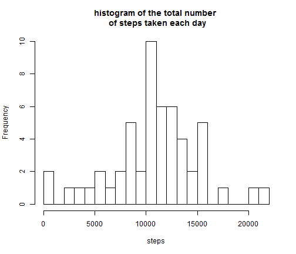
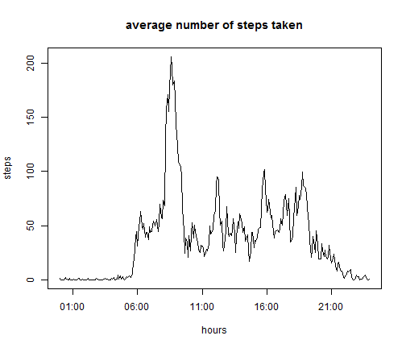

## Reproducible Research: Peer Assessment 1

More detailed informations about this research can be found in the [README][1]

[1]: https://github.com/Gwenael617/RepData_PeerAssessment1/blob/master/README.md

### Loading and preprocessing the data

The activity.zip file should be in your working directory. 
(this code won't download it)
First the code check if the .csv file exists, if not it will unzip it, 
and then read it. No particular preprocessing seems necessary.

_The code will require the stringr and lubridate packages, you may need to install them._


```r
if(!file.exists("activity.csv")){unzip(zipfile="activity.zip")}
activityData <- read.csv("activity.csv")
```


### What is mean total number of steps taken per day?

In the aggregate() function, the argument na.rm=TRUE ignores completely 
the NAs values while in the tapply() function, the argument na.rm=TRUE 
ends up considering those values as equal to zero instead of ignoring them. 
There were some discussions about that on the [forum][2]. 
I used the aggregate() function. To use the tapply() function, 
the NAs values need to be cleaned out first.

[2]:https://class.coursera.org/repdata-012/forum/thread?thread_id=36#comment-50

The following code calculate the number of steps taken per day 
and create a corresponding histogram :


```r
totalByDay <- aggregate(steps ~ date, data = activityData, 
                        FUN = sum, na.rm=TRUE)
hist(totalByDay$steps, breaks = 22,
     main = "histogram of the total number \n of steps taken each day",
     xlab = "steps")
```

 

The mean of the total number of steps taken per day is :

```r
mean(totalByDay$steps)
```

```
## [1] 10766.19
```
The median is :

```r
median(totalByDay$steps)
```

```
## [1] 10765
```

As the variable `totalByDay` already ignore the NAs values, 
it's not necessary to add the argument na.rm = TRUE while calculating 
the mean and the median.


### What is the average daily activity pattern?

In this question, as  we're calculating the mean instead of the sum, 
both the aggregate() or tapply() functions give the same result.

Here the code makes a time series plot of the 5-minute interval and 
the average number of steps taken, averaged across all days :


```r
avgSteps <- tapply(activityData$steps, activityData$interval,
                   FUN=mean, na.rm=TRUE)
## transform the intervals in hours:minutes
hm <- strptime(sprintf("%04d", as.numeric(names(avgSteps))),
               format = "%H%M")
plot(hm, avgSteps, type = "l", main="average number of steps taken", 
     xlab="hours", ylab="steps")
```

 

We can verify that there's no missing values left :


```r
sum(is.na(avgSteps))
```

```
## [1] 0
```

On average accross all the days of the dataset, the 5-minute interval 
which contains the  maximum number of steps is :


```r
library(stringr)
a <- sprintf("%04d", as.numeric(names(avgSteps[which.max(avgSteps)])))
paste0("it's the 5-minute interval starting at ",
       str_sub(a,1,2),"h",str_sub(a,3,4))
```

```
## [1] "it's the 5-minute interval starting at 08h35"
```


### Imputing missing values

The total number of number of rows with NAs is :


```r
nrow(activityData[is.na(activityData),])
```

```
## [1] 2304
```

I will replace the missing values by the 
__mean of the steps for that 5-minute interval__.

The following code produces a new dataset equal to the original but 
with the missing data filled in.


```r
naReplaced <<- activityData
for(i in 1:length(naReplaced[,1])){
  if(is.na(naReplaced[i,1])){
          naReplaced[i,1] <- 
   avgSteps[[which(names(avgSteps) == as.character(naReplaced[i,3]))]]
  }
}
```

It's easy to verify that there's no missing values left :

```r
sum(is.na(naReplaced))
```

```
## [1] 0
```

This code produces the new histogram of the total number of steps taken each day : 


```r
total3 <<- tapply(naReplaced$steps, naReplaced$date, FUN=sum)
hist(total3, breaks = 22,
     main="total number of steps taken each day \n (missing values filled in)",
     xlab = "steps")
```

 

The new mean is :

```r
mean(total3)
```

```
## [1] 10766.19
```
The new median is :

```r
median(total3)
```

```
## [1] 10766.19
```

Those values don't differ much from the original ones. 
The median moved to the mean but as most of the missing values are of 
whole days, ignoring them (first  calculation) or imputinng them 
(second calculation) doesn't create a big change. 
The result would be different is the spread of the missing data had been 
more scattered inside the days.


### Are there differences in activity patterns between weekdays and weekends?

The weekdays() function gives back the name of the days. 
However those names depend on the locale. 
They're in the language of the current locale. 
So if the code is run on a non english locale, subsetting by "Saturday" 
or "Sunday" won't work.
        
To avoid this problem and make this research fully reproducible without 
having to verify the locale, I'll use the wday() function from the 
lubridate package, which will give back the number of the day 
(Sunday being day number 1, Saturday being day number 7).


```r
library(lubridate)
type <- function(date) {
           if(wday(strptime(date, format = "%Y-%m-%d")) %in% c(7, 1)){
                    "weekend"}
           else {"weekday"}
        }
naReplaced$type <- as.factor(sapply(naReplaced$date, type))
```

To check that the new variable was properly created, the following code should point to a weekend :

```r
naReplaced[(288*5)+1,]
```

```
##      steps       date interval    type
## 1441     0 2012-10-06        0 weekend
```

and this one to a weekday :

```r
naReplaced[(288*3)+1,]
```

```
##     steps       date interval    type
## 865    47 2012-10-04        0 weekday
```

The code for the plot comparing the activity patterns :


```r
par(mfrow = c(2, 1))

## subsetting by weekend type and plotting :
avgWend <- aggregate(steps ~ interval, data = naReplaced, 
                     subset = type == "weekend", FUN=mean, na.rm=TRUE)
## transform the intervals in hours:minutes
hm <- strptime(sprintf("%04d", avgWend$interval), format = "%H%M")
plot(hm, avgWend$steps, type = "l", ylab="steps", xlab="hours",
             main = "weekends (avg)")

## subsetting by weekday type and plotting :
avgWday <- aggregate(steps ~ interval, data = naReplaced,
                     subset = type == "weekday", FUN=mean, na.rm=TRUE)
## transform the intervals in hours:minutes
hm <- strptime(sprintf("%04d", avgWday$interval), format = "%H%M")

plot(hm, avgWday$steps, type = "l", ylab="steps", xlab="hours",
             main = "weekdays (avg)")
```

 

This person seems more active during the weekends.
